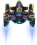

# ALIEN // ECLIPSE

A neon synthwave reimagining of the bundled assets — a vertical-scrolling shooter
in five hand-shaped stages ending with a phased boss that visibly disintegrates
through the `alien_big00…09` damage spritesheet.

Built as a single-file HTML5 Canvas + Web Audio game. No dependencies, no build
step, ~1k lines of JavaScript.



## Run

The game uses `fetch` to decode audio buffers (so the laser can be pitch-shifted
per shot and the music can duck on death), so it needs a real HTTP server —
opening `index.html` directly via `file://` will load images but skip audio.

```bash
python3 -m http.server 8000
# then open http://localhost:8000
```

That's it. Click **Engage** (a one-time gesture is required to unlock Web Audio)
and play.

## Controls

| key                     | action                          |
| ----------------------- | ------------------------------- |
| `← → ↑ ↓` / `WASD`      | move                            |
| `Space`                 | fire — **hold** to charge       |
| `Shift`                 | dash (i-frames + afterimages)   |
| `P` / `Esc`             | pause                           |
| `Enter` / `Space`       | confirm on menus                |

**Charge shot:** tap Space for a quick double-shot, or hold for ~1.1s — when the
magenta ring blooms around the ship, release for a piercing beam that tears
through anything in its column. **Dash** is your panic button: 0.16s of
i-frames, a short cooldown, and an afterimage trail so you know it fired.

## The arc

1. **I // DRIFT** — easy waves on a nebula backdrop. Learn to weave.
2. **II // CLUSTER** — V-formations and arcs. The first time the screen feels full.
3. **III // FRACTURE** — an asteroid field crashes mid-stage; the obstacles are
   destructible but tank a lot of damage.
4. **IV // SOLAR** — the **Solar Warden** appears: a `alien_big` mini-boss
   firing rotating bullet rings while normal waves keep coming. Drops a bomb on
   death.
5. **V // ECLIPSE** — the **Eclipse Queen**, full-size `alien_big` boss with three
   phases keyed off the 10-stage damage spritesheet: ring spread → aimed bursts
   → rage mode that summons adds. You can *see* her break apart as she takes
   damage.

Score thresholds, lives (3), and best score persist via `localStorage`.

## Power-ups

Drop chance is tuned per enemy type; the warden always drops a bomb.

- **T — Triple Fire** (10s): three-way spread.
- **S — Shield**: absorb one hit.
- **B — Bomb**: clear all enemy bullets, hit everything on screen.

## Design notes

The brief was "make it beautiful and fun — surprise me," so I leaned all the way
into **neon synthwave**: a tight magenta/cyan/violet palette, additive blending
for almost everything that glows (bullets, particles, explosions, charge halo,
shield), a CRT scanline + vignette overlay in CSS so the canvas always looks
like it's behind glass, and a pixel-crisp render path
(`imageSmoothingEnabled = false`) so the source sprites stay sharp at any scale.

The juice budget went mostly into **feel**: sub-frame screen shake whose
magnitude scales with the event (3 for a small kill, 18 for the warden, 30 for
the queen), per-shot pitch-shifted lasers via `AudioBufferSource.playbackRate`,
music ducking on player death, slow-mo (`timeScale = 0.18`) on the death frame,
white-flash hit feedback on every enemy, parallax starfields in four layers
with twinkle, drifting planet/sun in the back, score popups that float up and
fade with combo coloring (cyan → pink at x4+), engine particle trails behind
the ship that brighten on dash.

The **boss damage stages** are the centerpiece — the prompt called them out
specifically and they're the only part of the asset set that's hard to
substitute. The Eclipse Queen literally ages through the ten frames as she
loses health, and the phase transitions are tied to the same 0.66 / 0.33
thresholds so the visuals and behavior change in lockstep.

The mechanic I added on top of vanilla shooter rules is the **combo system**
(2-second decay, capped at x8) layered with the **dash**. Combo punishes you
for whiffing and rewards you for chaining the V-formations cleanly. Dash gives
you an out for the bullet patterns that would otherwise be unfair. Together
they create a tempo that keeps the runs interesting even when you've memorized
the waves.

## File layout

```
index.html    page shell, audio gate, CRT overlay
game.js       everything: loader, audio, input, entities, stages, render
images/       bundled sprites (untouched)
sounds/       bundled audio (untouched)
```

The original Python+pygame project is preserved at the previous commit if you
want to compare.
